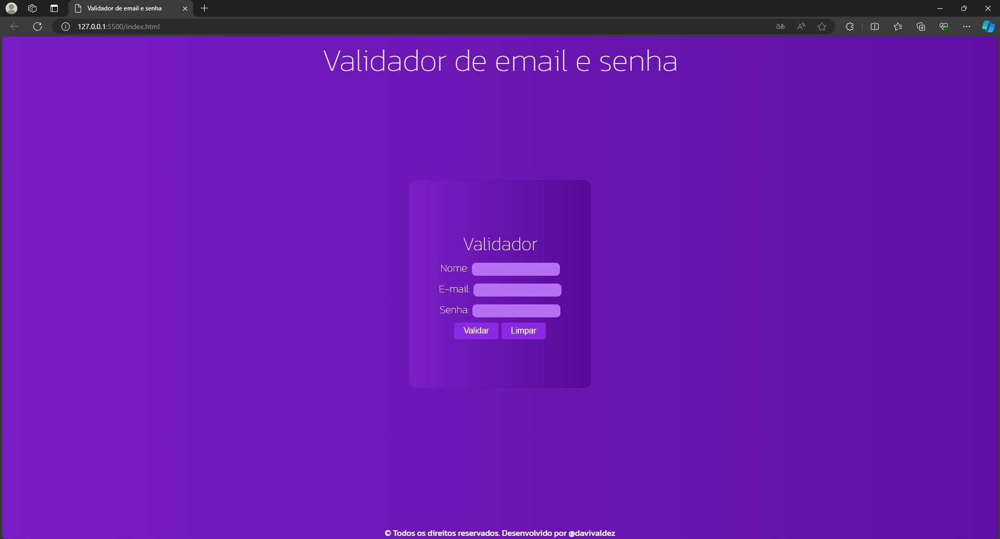
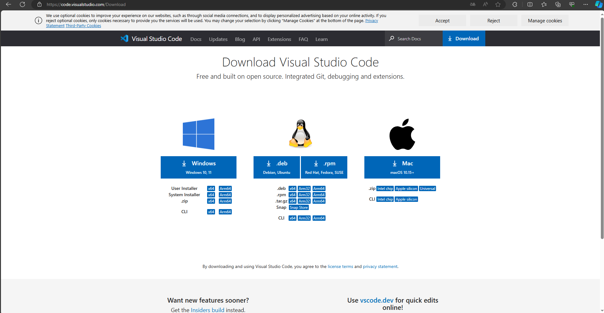
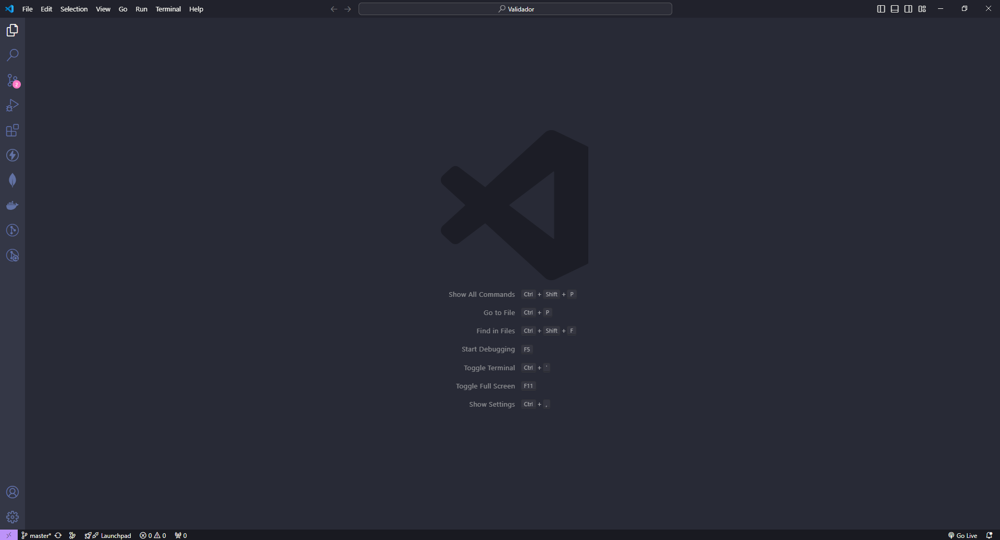
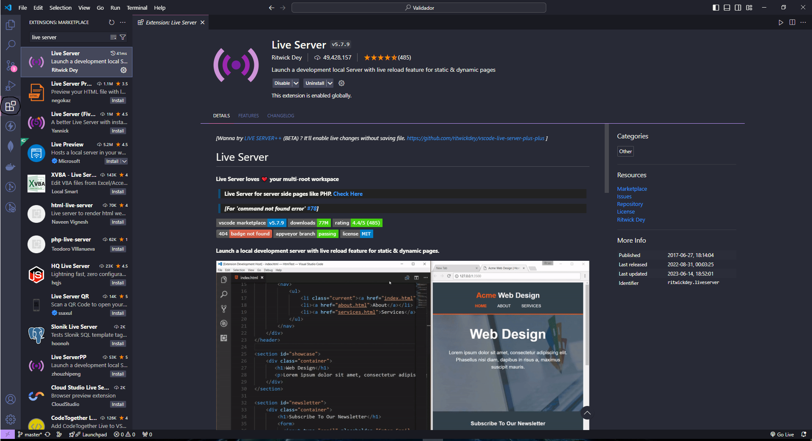
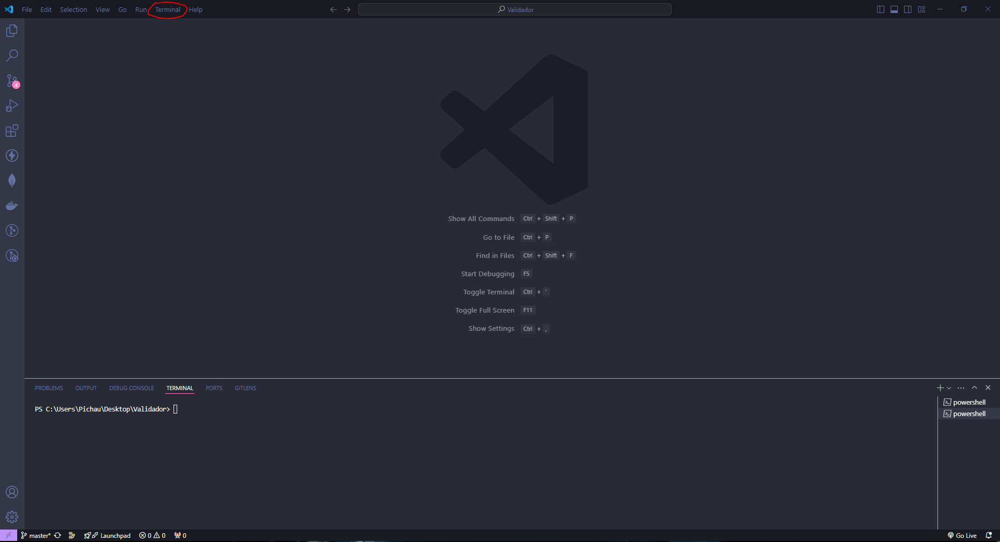
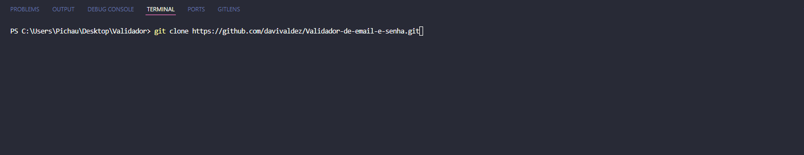
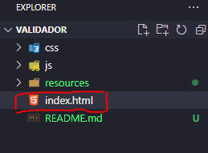

<h1 align="center" style="font-weight: bold;">Validador de e-mail e senha 💻</h1>

 <a href="#descrição">Descrição</a> • 
 <a href="#tecnologias-utilizadas">Tecnologias utilizadas</a> • 
 <a href="#instalação">Instalação</a> • 
 <a href="#uso">Uso</a> •
 <a href="#contribuição">Contribuição</a> •
 <a href="#contribuidores">Contribuidores</a> •
 <a href="#licença">Licença</a> 

    

## Descrição

Este projeto tem como objetivo validar e-mails e senhas com base em alguns critérios utilizando expressões regulares. A finalidade deste projeto foi para praticar o uso de expressões regulares.

## Tecnologias utilizadas:

- JavaScript.
- HTML.
- CSS.

## Instalação

### Pré requisitos

- VsCode.
- Extensão live server (VsCode).

### Etapas

1. Instale o VsCode em https://code.visualstudio.com/Download

   

2. Abra o VsCode.
   

3. Instale a extensão live server em "Extensions".
   

## Uso

1. Abra o VsCode.
   

2. Navegue até "File/Open Folder" e abra uma pasta existente vazia ou crie uma nova pasta para o projeto.

3. Abra o terminal.
   

4. Execute o seguinte comando: `git clone https://github.com/davivaldez/Validador-de-email-e-senha.git`
   

5. Abra o arquivo `index.html` com o live server.

   5.1 Clique com o botão direito sobre o `index.html` e seleciona a opção "Open with Live Server".

   

## Contribuição

Contribuições são bem-vindas! Siga as etapas abaixo para contribuir com o projeto:

1. Faça um **Fork** no repositório.
2. Crie uma **branch** para sua funcionalidade ou correção de bug: `git checkout -b minha-nova-funcionalidade`.
3. Faça um **Commit** para suas mudanças: `git commit -m 'Adicionando nova funcionalidade'`.
4. Faça um **Push** para a branch criada: `git push origin minha-nova-funcionalidade`.
5. Abra um **Pull Request**.

Obrigado por contribuir!

## Contribuidores

Atualmente, este projeto é mantido por um único contribuidor:

<table>
  <tr>
    <td align="center">
      <a href="https://github.com/davivaldez">
         
        
          <b>Davi Valdez</b>
        
      </a>
    </td>
  </tr>
</table>

Embora eu seja o único contribuidor até o momento, este projeto é aberto para contribuições da comunidade. Se você estiver interessado em contribuir, siga as instruções na seção de [Contribuição](#contribuição). Obrigado pelo seu interesse!

## Licença

Este projeto está licenciado sob a [MIT licensed](./LICENSE).
